<!-- ===================== HEADER ===================== -->

<p align="center">
  
</p>

<h1 align="center">
  
</h1>

<p align="center">
  
</p>

---

<div align="center">



</div>

---

<!-- ===================== ABOUT ===================== -->

## 🌊 About Me


```yaml
👤 Name     : Dilshod Durdiboyev
💻 Role     : Backend Developer & Database Engineer
🎓 Study    : IT Park Uzbekistan
📍 Location : Uzbekistan 🇺🇿
⚡ Passion  : Clean APIs + Powerful Databases
🌙 Style    : Night coder — best ideas come after midnight
🎯 Goal     : Build scalable, data-driven digital systems
🌊 Vibe     : Deep like the ocean, fast like a current
🔥 Focus    : Backend logic is my favorite puzzle
📚 Learning : Always exploring new technologies
```

> *"Code is like water — it finds its way through every problem."* 💧

<br clear="right"/>

---

<!-- ===================== DASHBOARD STATS ===================== -->

## 📊 GitHub Dashboard

<p align="center">
  
  
</p>

<p align="center">
  
</p>

<p align="center">
  
</p>

<p align="center">
  
</p>

---

<!-- ===================== TECH STACK ===================== -->

## 💻 Technologies

### ⚡ Backend & Fullstack

<p>
  
  
  
  
  
</p>

### 🎨 Frontend

<p>
  
  
  
  
  
</p>

### 🛢 Database

<p>
  
  
  
  
</p>

### 🧰 Tools

<p>
  
  
  
  
  
</p>

---

<!-- ===================== SNAKE ===================== -->

## 🐍 Contribution Snake

<p align="center">
  
</p>

---

<!-- ===================== FUN ZONE ===================== -->

## 🌟 Fun Zone

- 🌙 I code mostly at night when everything is quiet and the ocean calls  
- 🗄️ Database architecture fascinates me — I love designing data flows  
- ⚙️ Backend logic is my favorite puzzle to solve  
- 🌊 I think in queries and dream in schemas  
- 🚀 Goal: Become a world-class Backend & Database Engineer  
- 💧 Water teaches patience — so does debugging at 2AM  

---

<!-- ===================== CONTACT ===================== -->

## 📬 Contact

<p align="center">
  <a href="https://t.me/ddilshod2197">
    
  </a>
  <a href="https://linkedin.com/in/ddilshod2197">
    
  </a>
  <a href="mailto:ddilshod2197@gmail.com">
    
  </a>
</p>

---

<!-- ===================== OCEAN FOOTER ===================== -->

<p align="center">
  
</p>

<p align="center">
  
</p>
